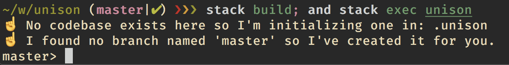
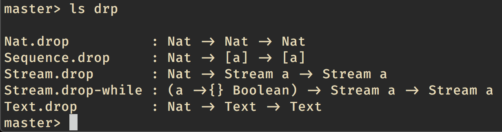
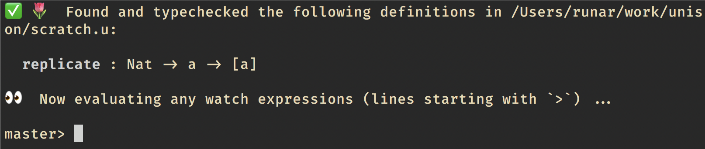
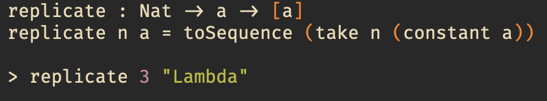
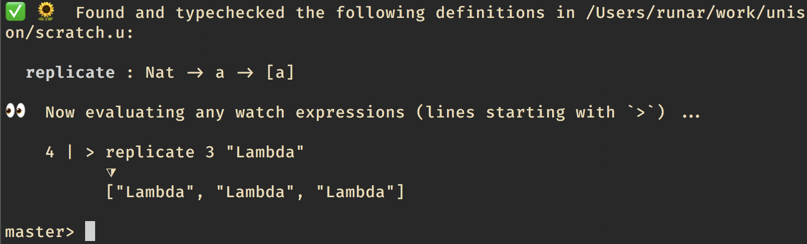
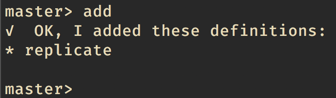
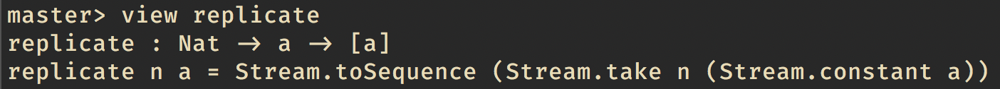
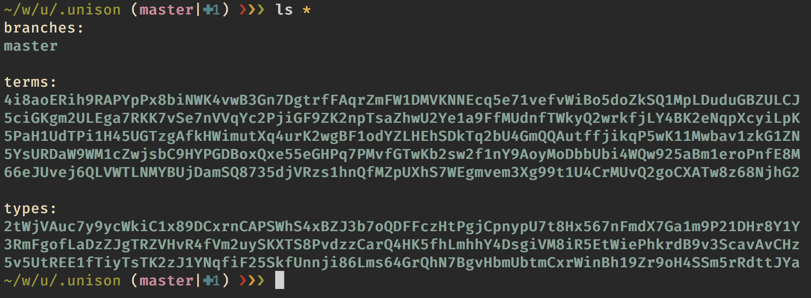
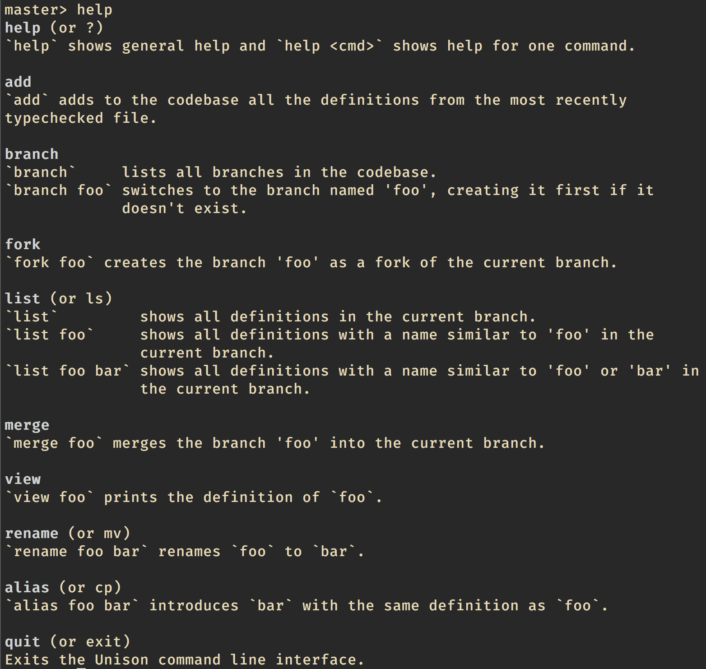

Hey everyone, Rúnar here. It's been a while since our last update. We've been busy.

## Spreading the word about Unison

* The video of [my talk from Lambda World Seattle](https://www.youtube.com/watch?v=rp_Eild1aq8) has been published to YouTube.
* Paul's talk [at Scale by the Bay](https://www.youtube.com/watch?v=v7L-5AQQkbM) is also up.
* I gave a talk on Unison at Øredev in Malmö, and also at the Reykjavík Functional Programming meetup. [A video is available of the latter](https://www.facebook.com/enkidudidu/videos/10218046671060964/).
* Arya did the hallway track at NeurIPS and got a sense of how researchers and industry are (or aren't) managing their distributed machine learning applications. This seems a good candidate for a Unison library.
* We created a number of GitHub issues and marked some of them as "good first issue" and "help wanted". If you've been thinking about contributing to Unison, this might be a good place to start. We'll add to these issues as we think of more ways contributors can help. Go to [https://github.com/unisonweb/unison/issues](https://github.com/unisonweb/unison/issues) to look at the list.

## Codebase editor progress

Meanwhile, we're making steady progress on the implementation, working mostly on the Unison codebase editor. Here's what you get now when you start up `unison`:

From here, you can explore and manipulate your Unison codebase. You'll note that Unison first creates a _branch_ called "master". A branch is really two things:

1. A collection of names for the hashes in your codebase.
2. A collection of edits to the codebase.

Right from the start, the master branch contains a number of predefined names for builtins. You can query the contents of the codebase using fuzzy matching:

The codebase knows the type of every definition, and later on we'll add the ability to query by type.

Oh, and we have tab completion already.

### Unison is watching

Instead of having a REPL in the traditional sense, Unison is watching for changes to `*.u` files under the directory in which it's started. I'll open a file called `scratch.u` and type a Unison definition into it:

If I save the file, my Unison session immediately shows this:

Note that it says it's "evaluating any watch expressions". I can add a watch expression just by adding a line that starts with `>` to my file.

If I save again, Unison comes back with the evaluated result of this expression:

### Adding and viewing definitions

I'm happy with that, so I'll ask Unison to add `replicate` to my codebase:

If I had put more (well typed) definitions in my file, Unison would have happily added those too.

Now that `replicate` is in my codebase, I can actually throw away the scratch file. If I need the definition of `replicate` again, I can always ask Unison for it:

### Git-friendly codebase structure

We really want to allow Unison developers to use good tools they're already familiar with like their favourite text editor, and Git. To that end, we've made it so that the codebase is just a bunch of (binary) files that can be versioned with Git.

Under the bonnet, Unison creates a directory called `.unison` which contains the codebase. There are three subdirectories here (currently); one for branches, one for type declarations, and one for term definitions. Under `types` and `terms`, we have one directory per hash which contains the compiled definition as well as any metadata.

Since everything is indexed by hash, you'll never actually change any file, so Git merge conflicts should never happen.

See [the Codebase Editor design document](https://github.com/unisonweb/unison/blob/master/docs/codebase-editor-design.markdown) for more information.

### More features

We're currently adding more features to the Codebase Editor. Right now we're making it easier to edit existing definitions that have a lot of dependencies, through a kind of structured refactoring session.

Here's the feature set we have so far:

