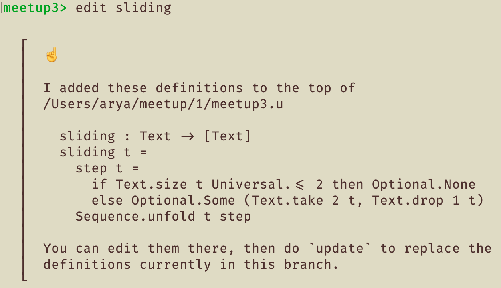
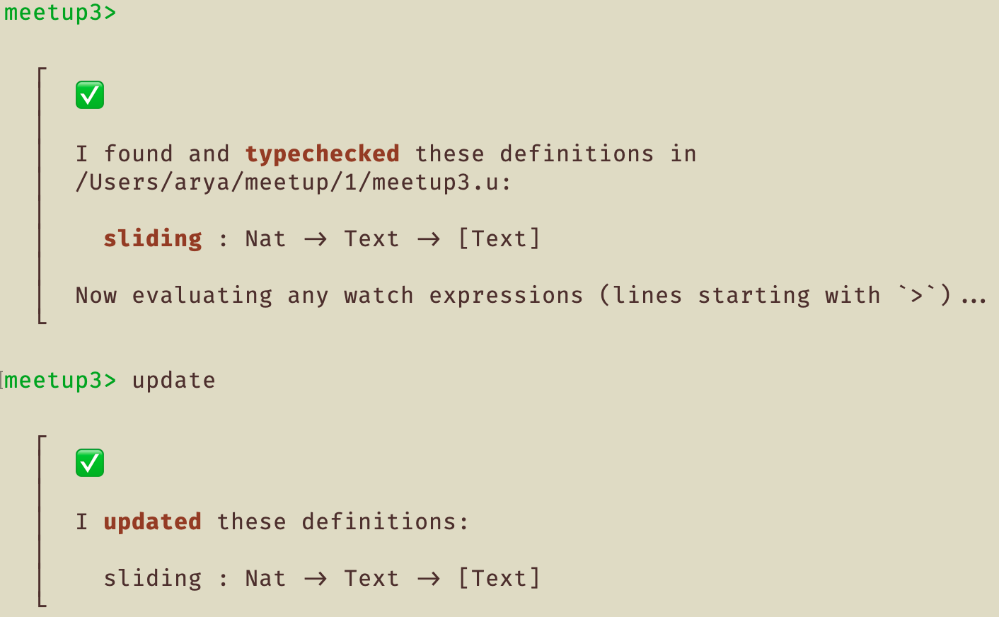
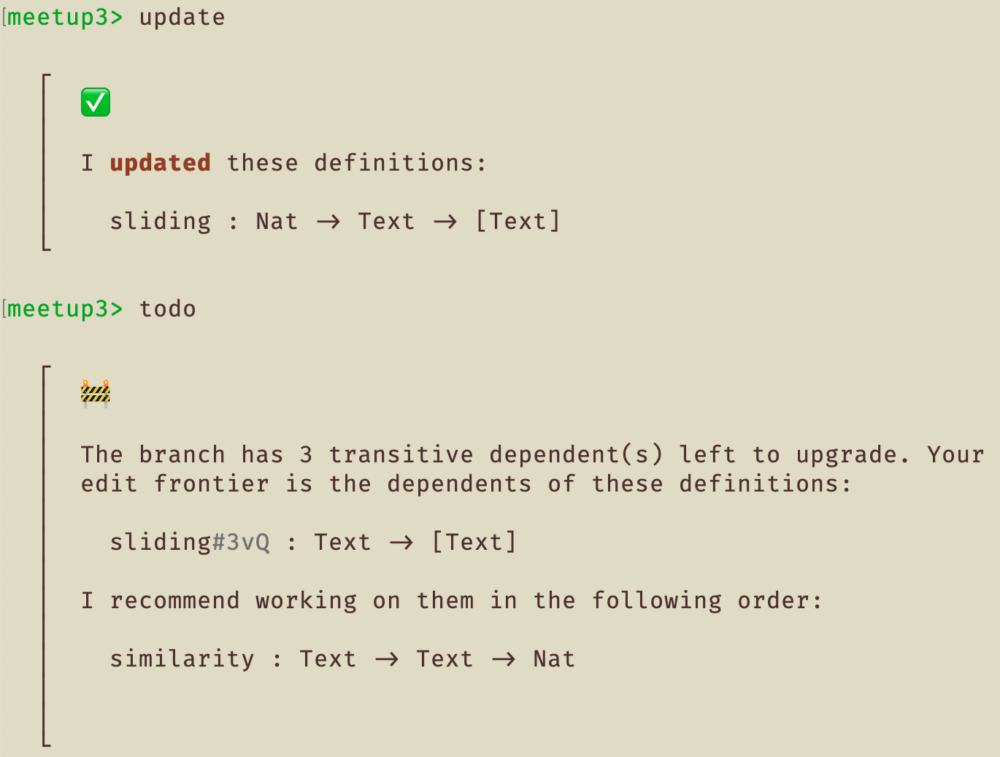
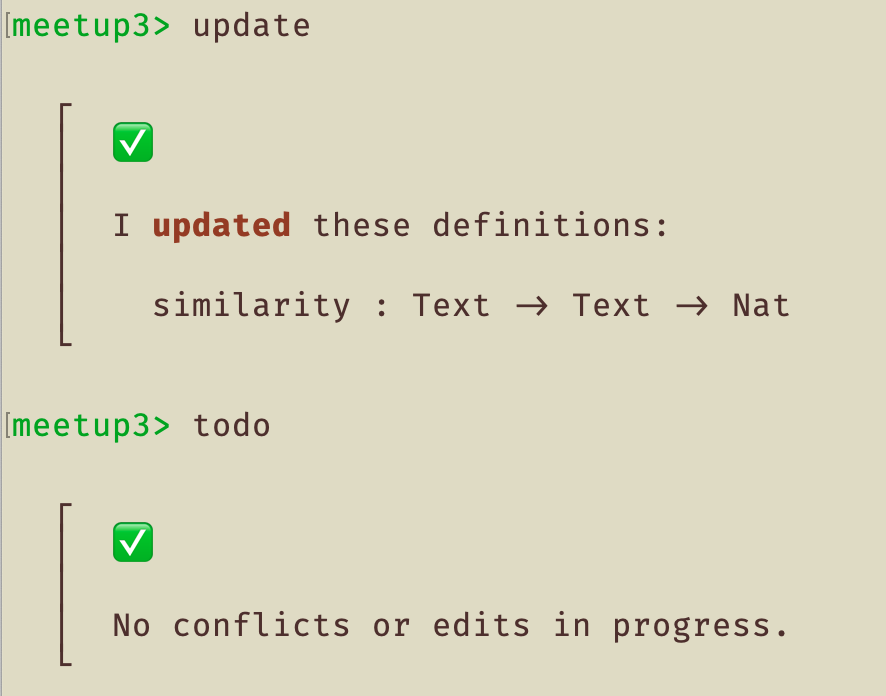
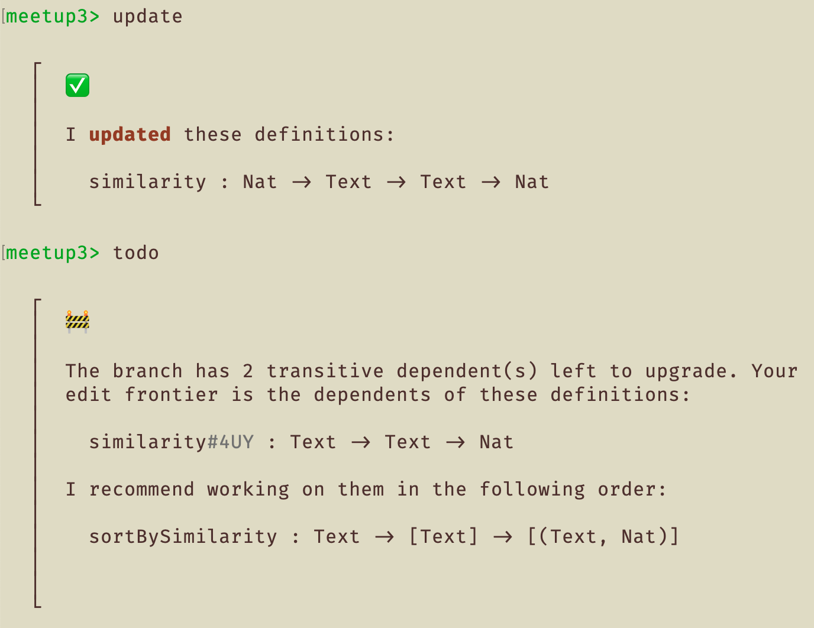
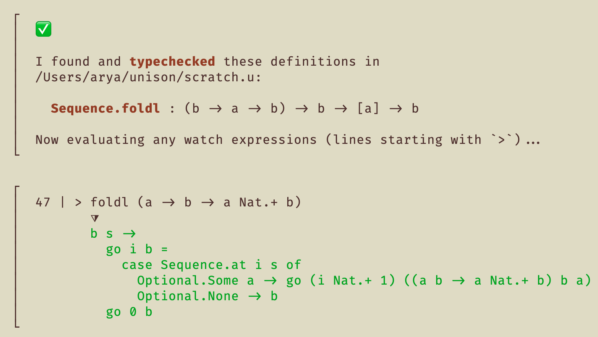
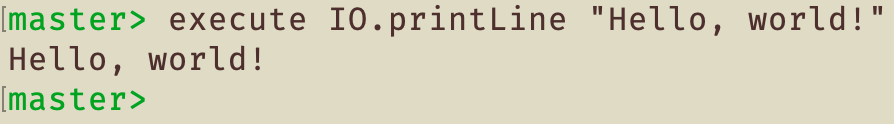
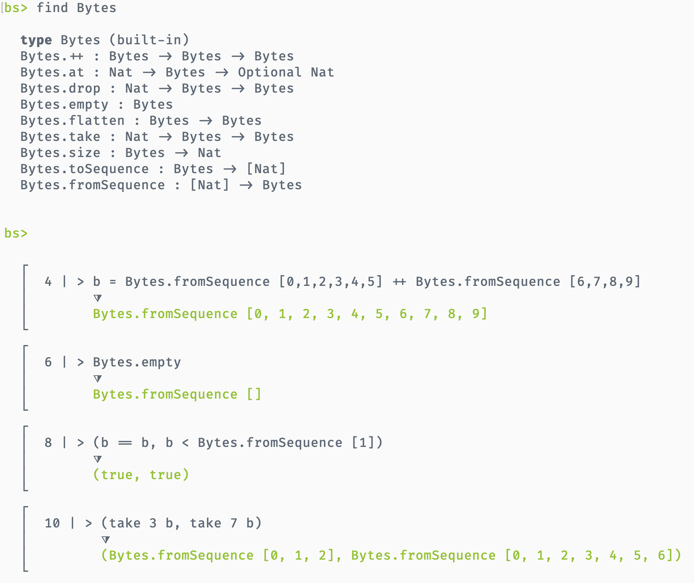
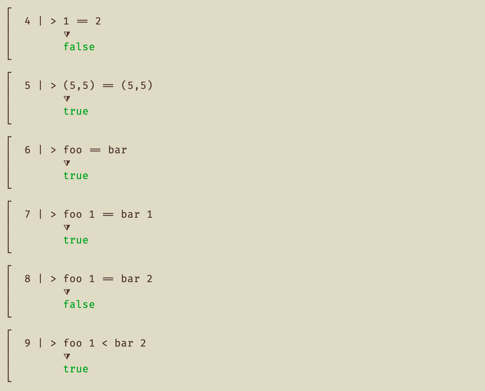

Hi all — it's been 464 commits since our last update post, and I hardly know where to start...

So, in arbitrary order:

## The first Unison Meetup

...went off without a hitch! Join the [Boston Unison meetup](https://www.meetup.com/Boston-Unison/) if you might like to come out to the next one. On Tuesday, about a dozen functional programming and future-of-computing enthusiasts gathered from around the greater Boston area to chat about their development experience, and let us show off our current progress, including:

## Actually editing existing code 😅

The `edit` command writes the text of the specified definition to disk for you to review or update.



Once you're satisfied with your changes, you can use the `update` command to replace an existing definition. (The usual `add` command won't let you add a definition with an existing name.)



Boom.

## Structured Refactors

Gone are the days where changing a function signature produces a cascade of unhelpful error messages from across your entire project, where fixing one error causes seven more. Unison will support a number of structured refactorings, the first of which is simply: _definition replacement_.

In this example, I've updated the original `sliding` function:

```unison
sliding : Text -> [Text]
```

to take an extra `width` parameter, instead of hard-coding it:

```unison
sliding : Nat -> Text -> [Text]
```



From this output, we can see that this update has _three_ transitive dependents. This is the maximum number of definitions that you could need to audit or update as a result of the change. More importantly, this number only goes down as you work!

Unison will recommend an ordering to your remaining updates, to minimize repeat work. (e.g. You if you updated `foo`, and `bar` depends on `foo` and `baz`, and `baz` depends on `foo`, Unison knows to recommend that you finish up `baz` before updating `foo`.)

In my example, I only had to update _one_ dependent to finish. Because I didn't change its type, there was no more manual work to do:



If I had instead decided to pass the new parameter into `similarity` as well, Unison knows there's more work to do, and guides me through the rest of that refactor:



For funsies, here are the replacements that Unison recorded:


## A Shiny New Runtime

We've jettisoned the Scala-based runtime and replaced it with a simpler, Haskell-based IR compiler and interpreter. As well as putting us in a better position for optimizations going forward (IR to LLVM, etc.), it's allowed us to incorporate the runtime into the codebase editor, simplifying installation and execution as well. (One build tool, one executable.)

Here we can see it, pretty-printing the result of partially applying a function:



## An IO ability

We've added a [preliminary `IO` ability](https://github.com/unisonweb/unison/blob/ed69a95128440f7976014d2826a0e0872662ba43/parser-typechecker/src/Unison/Runtime/IOSource.hs#L194-L281), and are in the process of implementing a native handler for it in the runtime.

We have also added the `execute` command to the codebase editor, which will evaluate `IO` expressions, such as your application. Eventually, you'll be able to start your application from the shell as well, by passing command-line arguments.



## A `Bytes` data type

The `IO` functions will likely use this eventually!



### Universal comparison

```unison
Universal.< : a -> a -> Boolean
Universal.<= : a -> a -> Boolean
Universal.== : a -> a -> Boolean
Universal.> : a -> a -> Boolean
Universal.>= : a -> a -> Boolean
Universal.compare : a -> a -> Int
```

The implementation works for all types, comparing values structurally. Even functions! We will probably do something in the future to give these a more constrained type and get our free theorems back.

At any rate, given:

```unison
use Universal ==
foo a b = a Nat.* b
bar x y = x Nat.* y
> 1 == 2
> (5,5) == (5,5)
> foo == bar
> foo 1 == bar 1
> foo 1 == bar 2
> foo 1 < bar 2
```

we get:



Not bad!

## Bugfixes

We've fixed a lot of bugs. 😅 Thank you to the masochistic handful who've been using the tool and reporting them, and special thanks to @noahaasis ([#328](https://github.com/unisonweb/unison/pull/328)), @francisdb ([#333](https://github.com/unisonweb/unison/pull/333), [#392](https://github.com/unisonweb/unison/pull/392)) , @mrziuban ([#382](https://github.com/unisonweb/unison/pull/382), [#385](https://github.com/unisonweb/unison/pull/385)), @benfradet([#418](https://github.com/unisonweb/unison/pull/418)), for their fixes.

## Unison-Related Projects

Discovering new Unison projects in the wild has been super gratifying. Here are two:

* [https://github.com/francisdb/unison-json](https://github.com/francisdb/unison-json) - JSON AST / parser / printer, written in Unison.
* [https://github.com/BenFradet/vscode-unison](https://github.com/BenFradet/vscode-unison) - Unison syntax highlighting for VS Code.

## What's up next?

The most immediate next steps towards the M1 release of the codebase editor include:

### More I/O!

File I/O! Network I/O! Concurrency! Universal `toString`? 🤔

### More types of types!

Today, any two Unison types are the same if the (multi)set of their constructor types is the same. We'll be introducing new-types and opaque types.

### More Codebase Editor work!

There are so many rough edges, but we'll get them one by one.

## That's all for now.

Thanks for reading, and keep the comments coming! Especially, let us know what you need to start your Unison-based project.
