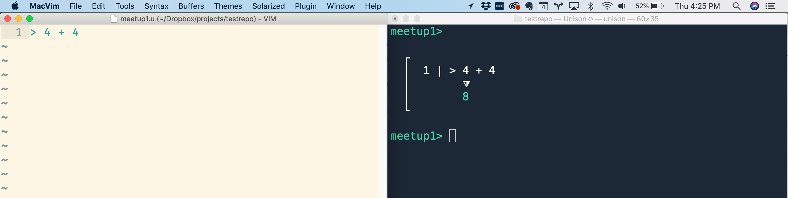
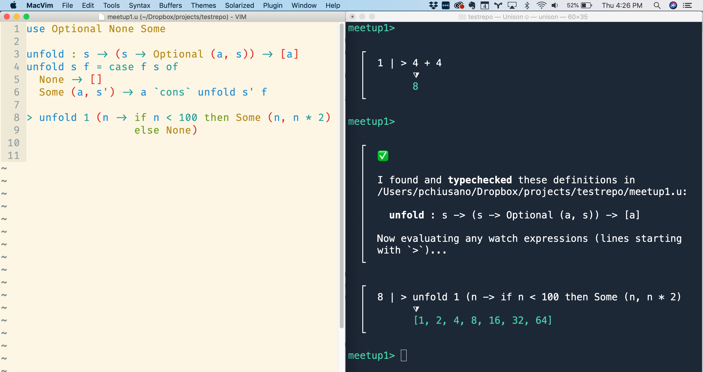
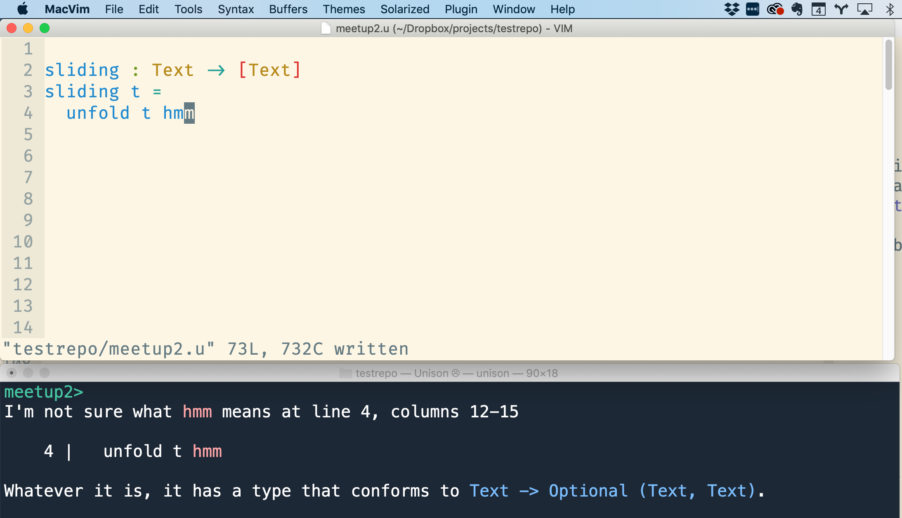
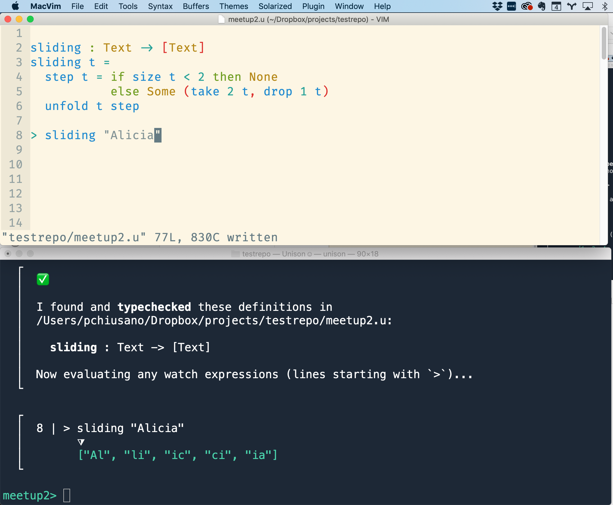

We had our [first ever Unison meetup last Tuesday](https://www.meetup.com/Boston-Unison/events/259532783/)! If you missed it or just want to look back on it fondly (or if like me you struggle to remember anything from more than 2 days ago..), this post is for you!! Myself, Arya, and Rúnar planned the agenda and presented. Overall: it was a lot of fun and I found it meaningful and motivating, thanks to everyone who came and who helped make it a success!

After some pizza and mingling, I started by giving a quick intro to Unison and the motivation for it: programming is fun, useful, and beautiful, and deserves great languages and tools that make the programming process delightful or at least REASONABLE in all aspects. Sadly, very little about how programming works has been intentionally designed or crafted; things are often done some way because of uncareful decision made long ago when computers still had 640kb of memory and we just didn't know better. 😬 Unison started as an experiment: what if you rethought programming today and tried to make it as amazing as possible?

Our thesis: there's one area in particular where current programming languages and tools result in lots of complexity, and that's building distributed, elastic systems. Though we're trying to improve programming generally, making whole distributed systems simply describable using one language has been an important motivator for the work on Unison, and led us to some core technical decisions.

From there, Arya and Rúnar introduced themselves and then we went right into a demo of Unison, as it stands today. It was a small group so we encouraged people to jump in with questions, and there were a lot of questions and discussion, which was all good! I'll include some of the questions inline as I go, and then some additional ones at the end. (Also, if you were at the event and this writeup is missing something, please leave a comment!)

Rúnar kicked off the demo by starting the `unison` command line tool, which he put on one half of the screen, and a text editor (he's a Vim user) on the other side. We're used to thinking of "the codebase" as a bag of text files that we mutate in order to evolve our codebase, but in Unison, the codebase is a more structured object which undergoes a series of well-typed transformations and is never in a broken state, more like a purely functional data structure.

He showed a little bit of the actual repository structure too: the codebase isn't just a giant binary database file, it has a directory structure that's designed with some cleverness to avoid ever producing a git merge conflict.

> Q: How? A: There are a few tricks but an important idea is to name files based on a hash of their content. Thus, files in the codebase format never change, only new files are introduced, and git merges directories of such files by taking their union.

When you start up `unison`, it watches for changes to `.u` files (which contain Unison code) in the current directory or any of its subdirectories. When it detects a change, it parses and typechecks any definitions in the file and then evaluates any "watch expressions", which are just lines starting with `>`. So one of the first things Rúnar did was open up a file `meetup1.u`, and type:

```unison
> 4 + 4
```

After saving the file, `unison` instantly responded with:

```
---
title: ucm
carets: true
---
master>

┌
│  1 | > 4 + 4
│        ⧩
│        8
└
```

Here's a screenshot of the setup:



This makes for a nice little interactive loop when developing code, and it replaces the need for a REPL (no more typing import statements or switching to a separate line-oriented editor to quickly test your code).

> Also note: the `meetup1>` prompt from the `unison` tool is saying that the `meetup1` is the current active branch. The Unison codebase has a notion of branches, which you can `fork`, `merge`, etc, similar to git, but they aren't modeled as git branches and you can easily reference code from multiple branches in the same program (which is useful for say, profiling or other cross-branch comparisons that are annoying to do in git).

From there, Rúnar wrote a function `unfold`, which generates a list by repeatedly applying a function to some state to produce an output value and a new state. He then used it to generate the powers of 2 less than 100:

```unison
use Optional None Some

unfold : s -> (s -> Optional (a, s)) -> [a]
unfold s f = case f s of
  None -> []
  Some (a, s') -> a `cons` unfold s' f

> unfold 1 (n -> if n < 100 then Some (n, n * 2)
                 else None)
```



Once he was satisfied with that, he typed `add` in the command line tool to add the `unfold` definition to the codebase. He then **deleted** the code from his `meetup1.u` scratch file!! We don't need the original source once the code has been slurped up into the codebase since we can view or edit it at any time later. He demonstrated this by typing `view unfold` which showed the very same `unfold` function he just wrote (but autoformatted) and then `edit unfold` which added this source code to the top of his scratch file for further editing.

Rúnar showed a few other features of the `unison` tool: you can easily search for and view definitions that exist in the codebase, and you can trivially rename definitions. So for instance, he took a look at the `Optional` type, which is used by `unfold`:

```
---
title: ucm
carets: true
---
> view Optional

  type Optional a = None | Some a
```

And he then did a `rename Optional.None Nothing` and `rename Optional.Some Just`, renaming those two constructors of `Optional` to `Nothing` and `Just`. A subsequent `view unfold` showed this rename had been propagated:

```unison
unfold : s -> (s -> Optional (a, s)) -> [a]
unfold s f = case f s of
  Nothing -> []
  Just (a, s') -> a `cons` unfold s' f
```

He emphasized an important point here that this `rename` operation isn't like an IDE doing a bunch of text munging on your behalf, resulting in a massive textual diff and also breaking any code outside your IDE's purview (like your library's downstream users). Rather, the `unfold` definition and any other code that depends on `Optional` is _completely unchanged_ by the renaming of the `Optional` constructors, and you're free to make these name changes without fear of breaking anything (even code you don't know about). A `rename` is always 100% accurate and instantaneous. Nice!!

Unison achieves this by giving a unique, content-based cryptographic hash for each definition, and referring to other code using these hashes. The mapping of names to hashes is just metadata for humans, used to resolve names to hashes at parse time when slurping up code into the codebase, and used for the other direction when displaying code for the user. Doing `ls -l unfold` (vs just `ls unfold`) shows the hashes alongside the signatures, which Rúnar also showed.

People had a bunch of questions, here are a few of them:

* Could the `find` / `ls` command show docstrings or other more useful information besides just the type signature?
  * Yes, totally, this is a good idea! Not implemented yet though.
* Are these hashes affected by variable names?
  * No. Variable names are converted to their [De Bruijn index](https://en.wikipedia.org/wiki/De_Bruijn_index) as part of the hashing algorithm, so name choices don't affect the hash. For instance `id x = x` will hash the same as `identity a = a`, since both the `a` and `x` will have the same De Bruijn index of _0_.
* What happens to comments?
  * Currently, they are thrown out by the lexer! This is pretty silly. An uncontroversial choice would be to just not do that and instead attach them to the AST.
  * But there is some room for innovation here, making comments more structured, rather than just blobs of freeform text. (For instance, imagine if comments mentioning `Optional.None` could be automatically renamed as well, with 100% accuracy.)
* Are module cycles a thing?
  * No. You only have a cycle if you have mutually recursive definitions. You can never create a cycle by adding a new definition that references only previous definitions. This behavior comes for free because Unison tracks dependencies at the most fine-grained level possible: individual definitions.

We pointed out that you can also give multiple names to the same hash and you can depend on a single definition rather than an entire library. This led to more good questions:

* Hmm, how do these more fine grained dependencies work out in practice? What about the diamond dependency problem and dependency hell?
  * We punted on talking about this one in detail (but it would be cool to spend a session even just on this), but the basic answer is that many of these concerns just disappear with the Unison approach of making all definitions immutable and content addressed. We should do a follow-up post on this one.
* Can people use their own naming preferences for the same definitions?
  * That makes total conceptual sense and would be easy to do but we haven't implemented anything for it yet.
* What happens if two people pick the same name (say `frobnicate`) for different definitions?
  * That's fine as long as `frobnicate` names exist in separate branches: each Unison branch gets its own namespace. If those branches get merged, then Unison will encourage (but not require) that you rename one or both. In the meantime, the merged branch is still usable and the names will be shown as `frobnicate#2aQjd` and `frobnicate#9jfPv` (we call these names "hash-qualified").
  * Also: you can use qualified names, like `pchiusano.utils.frobnicate` and we expect people will do this. If people adopt this convention, name conflicts arise more when people working within the same project, like if Alice and Bob both add a different `frobnicate` definition to the same module.

### Fuzzy string matching

Rúnar then handed it over to me to implement something a little less trivial. I used his `unfold` function to implement a fuzzy text matching algorithm. Before prepping the talk, I was only familiar with using edit distance for this purpose, but I recently learned a nifty little algorithm, called [Strike A Match](http://www.catalysoft.com/articles/StrikeAMatch.html), which I implemented. The algorithm just _compares the overlap in the set of adjacent character pairs_. So, for instance, the text `"Alice"` and `"Alicia"` can be broken up into the character pairs:

```
"Alice"  -> {"Al", "li", "ic", "ce"}
"Alicia" -> {"Al", "li", "ic", "ci", "ia"}
```

Notice it has three character pairs in common (`{"Al", "li", "ic"}`), among 6 total in their union. So a simple metric of their similarity is just the size of the intersection divided by the size of the union (sometimes called the [Jacaard index](https://en.wikipedia.org/wiki/Jaccard_index)).

First I started implementing `sliding`, a function to get all these adjacent character pairs, using `unfold`. I showed how you can type any unbound symbol (I like `hmm`) and have Unison tell you what type it's expecting there, which is handy when filling in arguments.



Eventually I got:

```unison
sliding : Text -> [Text]
sliding t =
  step t = if Text.size t < 2 then None
           else Some (take 2 t, drop 1 t)
  unfold t step

> sliding "Alicia"
```



And then after that worked fine, I went ahead and used `sliding` to implement the similarity function:

```unison
-- number in 0 to 100 where 100 means sets are the same
-- 0 they are totally different
jacaard : Set a -> Set a -> Nat
jacaard s1 s2 =
  100 * (Set.size (s1 `intersect` s2))
      / (Set.size (s1 `union` s2))

-- uses type-directed name resolution to resolve to Set.fromSequence
-- should be 50, since intersection is size 1, and union is size 2
> jacaard (fromSequence [1]) (fromSequence [1,2])

similarity : Text -> Text -> Nat
similarity t1 t2 =
  jacaard (fromSequence (sliding t1))
          (fromSequence (sliding t2))

> similarity "Alice" "Alice"
> similarity "Alice" "Alicia"
> similarity "Alice" "Bob"
> similarity "French" "France"
```

Here's the output:

```
---
title: output
carets: true
---
┌
│  8 | > sliding "Alicia"
│        ⧩
│        ["Al", "li", "ic", "ci", "ia"]
└
┌
│  16 | > jacaard (fromSequence [1]) (fromSequence [1,2])
│         ⧩
│         50
└
┌
│  23 | > similarity "Alice" "Alice"
│         ⧩
│         100
└
┌
│  24 | > similarity "Alice" "Alicia"
│         ⧩
│         50
└
┌
│  25 | > similarity "Alice" "Bob"
│         ⧩
│         0
└
┌
│  26 | > similarity "French" "France"
│         ⧩
│         25
└
```

Success!!

Since I've started programming with watch expressions that instantly update like this, I never want to go back to using a REPL for exploration or quick testing, and it's possible to extend the idea just a little bit to support writing tests that become a more permanent artifact of your codebase as well (and the test results can be perfectly incrementally computed).

### Refactoring

Arya then took over, showing our progress on making it nice to refactor a Unison codebase. He has more of a writeup [in this post](./updates.html#post-start). The basic idea is that you are never dealing with a morass of compile errors, many of which are misleading or covering up other errors. Instead, the command line tool walks you through the refactoring step by step, one update at a time, in a sensible order that avoids repeatedly updating the same definitions. Even though there's more work to do to make the actual UI for this nice, I'm convinced that the approach is the Right Thing™️ and in the future we'll look back on the status quo and wonder WTH we were thinking!

### Other questions

Here's a smattering of other questions that I remember (if I've missed any please leave a comment):

* What's the type system?
  * Unison starts with Dunfield and Krishnaswami's [Complete and Easy Bidirectional Typechecking for Higher-Rank Polymorphism](https://www.cl.cam.ac.uk/~nk480/bidir.pdf). That type system has very good type inference and supports higher supports higher-rank types as well. I'd say our extensions to what's in the paper were very straightforward: we added data types, pattern matching, let / let rec, and a few other language constructs which weren't in the original paper for simplicity. Neel Krishnaswami was helpful in answering various questions we encountered while implementing it!
  * For Unison's algebraic effects, we adapted [Frank's type system](https://arxiv.org/abs/1611.09259), by Lindley, McBride, and McLaughlin, and Conor McBride helped in answering questions abaout it. Some of the changes vs Frank are kind of interesting and we'll probably do a writeup of that at some point.
* What about bounded polymorphism and typeclasses? This deserves a longer post, but here are a few answers:
  * For just name overloading, Unison supports that via type-directed name resolution.
  * For effectful programming, you use algebraic effects, no need to pass dictionaries around.
  * Functions like `<`, `==`, etc, work for any type (actually we'll probably restrict their type a bit just to keep parametricity in tact). But these are builtins, you can't implement your own (could we somehow make that possible though?).
  * The only thing that Unison has which is as general as typeclasses is explicit dictionary passing. This can sometimes be a bit tedious.
  * Typeclasses are super convenient but I don't think that as is they're a good fit for Unison, and they have problems even in the Haskell world ([relevant post](http://pchiusano.github.io/2018-02-13/typeclasses.html)). Also, not for nothing: they're a pain to implement.
  * Summary: We're thinking about it. If you've got ideas, let us know!

There was an interesting discussion around typeclasses after the meetup (some folks headed over to a local pub for drinks and food). All the approaches to bounded polymorphism (typeclasses a la Haskell, modules a la ML / Scala, dictionary passing + implicit parameters, OO style subtyping ..) have strengths and weaknesses. And that's the problem: there's no approach that's a total slam dunk, which makes you think "YES, PROBLEM 100% SOLVED." Every approach has its issues. I'm hoping for some bolt of insight about this…

### That's all!

I hope this writeup was useful for folks. We're going to try doing the meetups monthly. Something else we've considered doing in addition to the in person meetups is an "online only" meetup over Twitch. If you're not local to the Boston area but have an interest in doing something like this, let us know!
