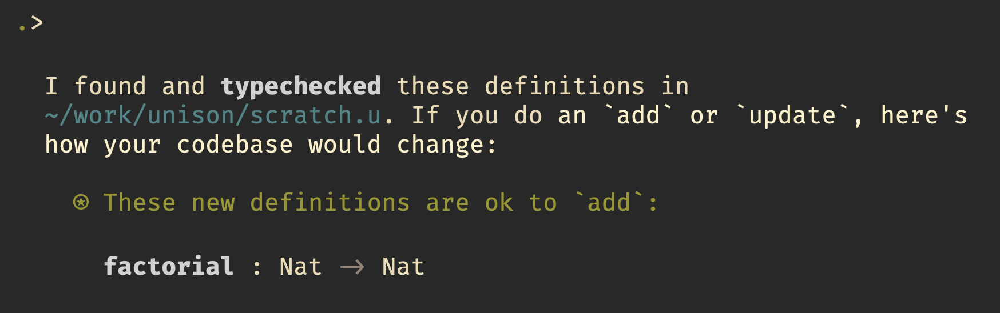
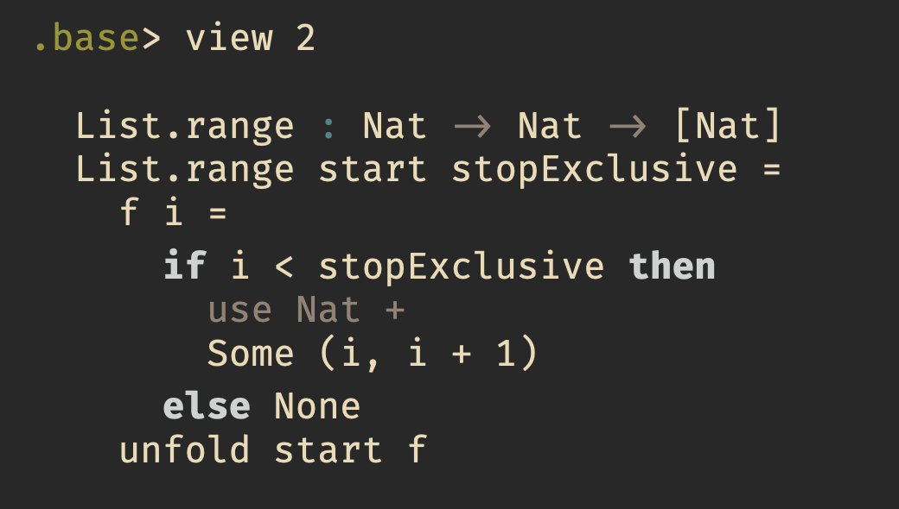
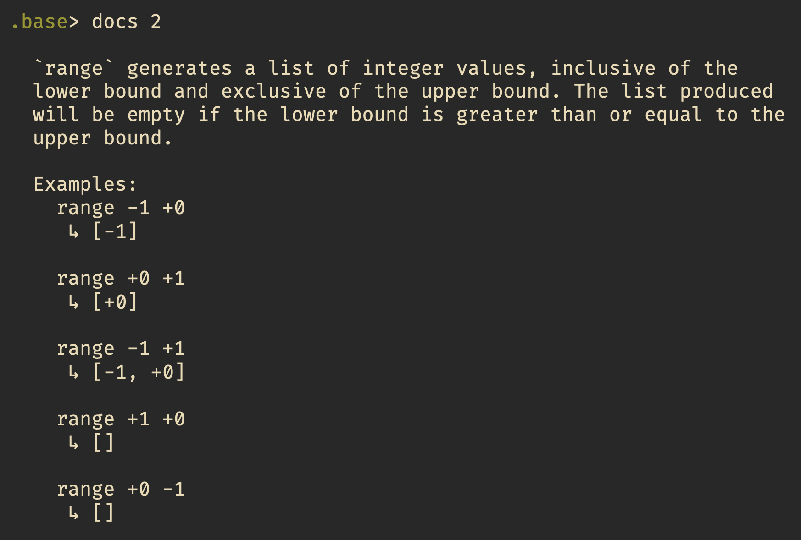
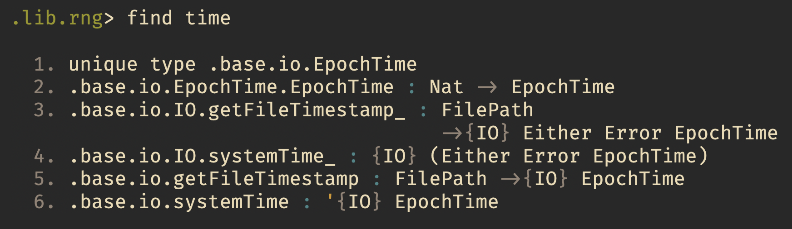
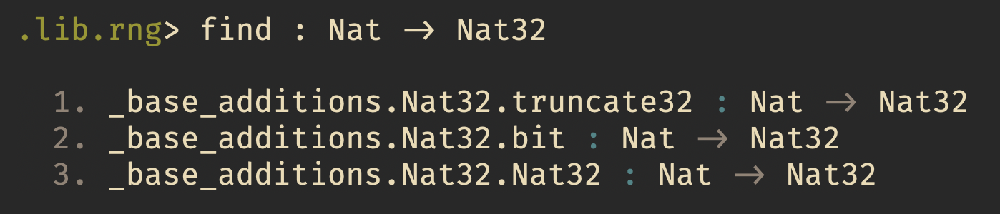

Last week we released another Unison alpha milestone. This release has a [number of bugfixes and performance improvements](link to release notes). :rainbow::star:

It's exciting to see Unison gradually coming together, but even more exciting has been seeing people writing and publishing Unison code. I've been pretty busy reviewing pull requests to the [Unison base libraries](http://github.com/unisonweb/base), and there's already a lot of useful stuff there. Thanks to everyone who has contributed so far!

A number of folks have been working on their own Unison libraries and we're collecting these [on a page of this site](https://www.unisonweb.org/docs/libraries/). I want to highlight just one of these, which is a random number generator. There are many other cool libraries, but I picked this one at random. The main thing I want to highlight is just how easy it is to create and use Unison libraries.

## Starting up

If you've been putting off trying out Unison because you think getting into a new language might be a lot of work and involve a lot of setup, then I've got good news for you: Unison requires almost no setup. You can just start coding.

To get going with Unison, you can go through the [three minute quickstart guide](https://www.unisonweb.org/docs/quickstart/). It only has three steps.

Once set up, `ucm` starts the Unison Codebase Manager:


I can now just start writing Unison code in any file in the directory from which I started `ucm`, as long as that file's name ends in `.u`. I open up a file `scratch.u` with  `vim` (my favorite editor), and write my first definition, the obligatory `factorial` function:

```unison
factorial n = List.foldr (*) 1 (range 2 (n + 1))
```

If I save my scratch file, Unison responds with:



It's telling me that `factorial` is a function that takes a `Nat` (a 64-bit unsigned integer), and returns another `Nat`. I can add this function to my codebase:


I can try out my function right in the scratch file by adding a "watch expression", which is any line that starts with `>` (or an indentation block where the first line starts with `>`).

```unison
> factorial 10
```

Unison reponds by evaluating my expression:


## Looking around the base library

The `base` library is already full of good stuff, with new things being added almost daily now. To see what's here, I can browse with UCM. If I do `list .base` (or `ls .base`), I get a long list. I can `cd` into any namespace and look around with `ls`.

In the definition of `factorial` above, I was using `foldr` and `range`. If I ask UCM to `find range`, it responds with everything it knows about with `range` in the name:


The second entry is the function I was using, `List.range`. I can ask for its definition either by name or by using the number from the list that UCM produced:



The `docs` command (try `help docs`) shows me the documentation for a given function or type, if it has any docs associated with it.




## Let's have a look at a third-party library

Looking at the [list of libraries that people have already made](https://www.unisonweb.org/docs/libraries/), I want to pick one, kind of at random, and just play with it to give you a feel for what it's like to consume libraries in Unison. And speaking of random, it looks like one of them is [a random number generator that uses a Mersenne twister](https://github.com/atacratic/unison-random-mersenne), written by Chris Gibbs. Let's try that out.

Chris has supplied handy install instructions, so let's just do as he says:

```
.> pull https://github.com/atacratic/unison-random-mersenne.git:.releases._v1 external.unison_random_mersenne.v1
```

Lots of stuff scrolls by, and Chris's library is now in my codebase. The namespace `external.unison_random_mersenne.v1` is kind of long for my taste, so I'm just going to move it under `lib.rng`. 

```
.> move.namespace external.unison_random_mersenne.v1 lib.rng
```

I'm using tab completion for this instead of typing out the whole thing. I `cd lib.rng` and look around.


Looks like there's a `README`, which is a Unison value of type `Doc`. I can ask UCM to render any `Doc` with the `display` command. In the `README` there's a usage example which shows me how to generate some random numbers.

I put a triple dash `---`, a "fold", on a line at the top of my `scratch.u` file, which tells Unison to ignore everything below. I've already added `factorial` to my codebase, so I don't need to think about that anymore. It goes below the fold. Above the fold, I put an expression to generate a single random number between 0 and 10 which I got from the README.

```unison
> mersenne.provide (nextFromRange 0 11) defaultSeed 'ask
---
factorial n = List.foldr (*) 1 (range 2 (n + 1))
```

I wonder what this `mersenne.provide` is. Let's ask Unison.


OK, so `provide` generates numbers by providing a `Store State` ability, where `State` is the Mersenne twister's internal state. The `Nat32` is the seed, and this `Ask n` thing is a computation that can ask for a random `n` (which in my case is going to be `Nat`).

Looks like this library puts a lot of its guts on display, so I'm going to try to write a more abstract interface for it. What I really want for a random number generator ability is something like this:

```
ability RNG where
  nextNat : Nat
```

I can write a (recursive) handler for this ability that uses the Mersenne twister:

```
mersenneRNG : Nat32 -> '{RNG,e} a ->{e} a
mersenneRNG seed x =
  h = cases
    { nextNat -> k } -> handle (k !nat.next) with h
    { a } -> a
  mersenne.provide '(handle !x with h) seed 'ask
```

Great! So now I can request a random `Nat` just by saying `nextNat`, and I can handle that request with `mersenneRNG`by providing a seed. But sometimes I don't want to provide a seed, and I just want to generate a random number as an `IO` effect. Let's try to feed it the system time.



OK, we can get an `EpochTime`, which wraps a `Nat`, using `systemTime`. Can we turn that into a `Nat32` as required by `mersenneRNG`? A type-based `find` turns up 3 different functions:



Skimming the `docs` for these, I see that `truncate32` is probably the thing I want. It truncates the high 32 bits, leaving me with just the least significant bits of the clock. So I write:

```
clockSeed : '{IO} Nat32
clockSeed _ =
  match !systemTime with 
    EpochTime t -> truncate32 t
```

And finally I use the `mersenneRNG` handler from earlier:

```
mersenneIO : '{RNG,e} a ->{IO,e} a 
mersenneIO x = 
  mersenneRNG !clockSeed x
```

An example of using this in a program might be:

```
main : '{IO} ()
main = 'let
  printLine (Nat.toText (mersenneIO 'nextNat))
```

I `add` all of that to a `scratch` namespace in my codebase:


Let's try to run it. UCM provides a `run` command which provide the `IO` ability to something of a type like `'{IO} a`.


Great! I got a random number using the system clock time as a seed. Maybe at some point I'll [send a pull request](https://www.unisonweb.org/docs/codebase-organization/#day-to-day-development-creating-and-merging-pull-requests) to Chris so he can incorporate some of this into his library.

## Conclusion

I hope this gives you a taste of what it's like to work in Unison with the current alpha release, and that this encourages you to try it out and maybe contribute some libraries. Remember, it's early days yet, so little things you build now could make a big impact on the Unison community for the future.
